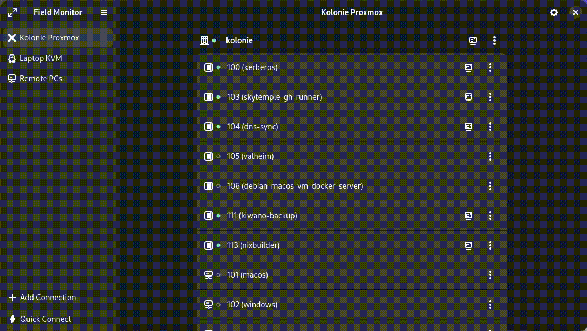

# Field Monitor 

Access virtual machines and other external screens

 TODO XXX

Field Monitor is a remote-desktop client designed for the GNOME platform.

It is focused on connecting to virtual machines, but can connect to any server
supporting the RDP, SPICE or VNC protocols.

It has support for directly connecting to VMs of the following hypervisors:

- Proxmox
- QEMU/KVM via libvirt

For supported VM hypervisors Field Monitor also offers options to manage the basic
power state of VMs, such as starting, stopping, rebooting, etc.

Additionally, Field Monitor supports opening RDP and Virt Viewer connection files
and quickly connecting to RDP, SPICE or VNC servers via URI.

## Installation

### From Flatpak

Field Monitor can be downloaded via Flathub.

> [!IMPORTANT]
> TODO! As of writing Field Monitor is not yet published.

### For NixOS

> [!IMPORTANT]
> TODO! As of writing Field Monitor is not yet published.

### From Source

Field Monitor can be built from source using Meson. For a list of requirements, please see
[CONTRIBUTING.md](CONTRIBUTING.md).

## Contributing

Thank you for considering to contribute to Field Monitor! Field Monitor is free
software and lives from people investing time into making it better.
Please see [CONTRIBUTING.md](CONTRIBUTING.md) to get started.

## Copyright

© 2025 [Marco Köpcke](https://github.com/theCapypara) and contributors

## Acknowledgements

Field Monitor would not be possible without Marc-André Lureau's [RDW](https://gitlab.gnome.org/malureau/rdw),
the remote-desktop widgets that power all RDP, VNC and SPICE connections. Thank you!

## License

Field Monitor is free software, licensed under the GNU General Public License v3.0,
please see [COPYING](COPYING) for more information.
